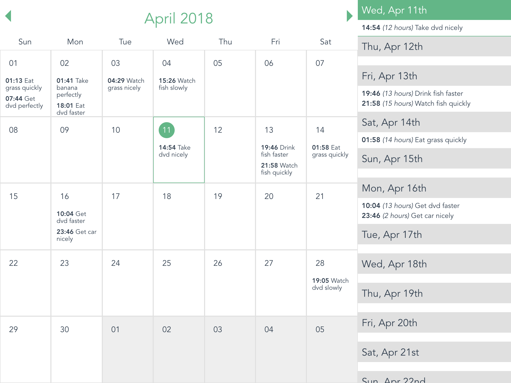

# drc-calendar [](https://travis-ci.org/danilojunS/drc-calendar)

> Calendar and agenda, built in Vue.js



# Introduction

This app is a calendar with a built-in agenda, which shows dinamically generated events in the current year.

It has the following features:

* At the top of the calendar, the weekdays are displayed starting by Sunday.
* In the calendar, one can view the events that are going to happen in each date.
* It is possible to navigate in the months of the year, using arrows in the top of the calendar.
* When selecting a date in the calendar, the date is highlighted and the agenda scrolls to the selected date.
* The agenda displays all days of the year.
* In each event in the agenda, the following information should be shown: start time, duration and title.
* The calendar should start in today's date.
* When scrolling the agenda, the calendar should follow it, by displaying the same month.

This app is my first try on [Vue.js](https://vuejs.org/)!

While trying to use as many concepts I learnt from [React](https://reactjs.org/), I might have not followed the "vue way" for doing things (Vue community, sorry for that 😓).

On the plus side, this challenge was really interesting and rewarding. Also, I am getting more and more interested in the Vue.js ecossystem.

# Installing and Running

``` bash
# install dependencies
npm install

# serve with hot reload at localhost:8080
npm run dev

# build for production with minification
npm run build

# build for production and view the bundle analyzer report
npm run build --report

# run unit tests
npm run unit

# run all tests
npm test

# serve storybook with hot reload at localhost:9001
npm run storybook
```

For a detailed explanation on how things work, check out the [guide](http://vuejs-templates.github.io/webpack/) and [docs for vue-loader](http://vuejs.github.io/vue-loader).

# Design and development

First, I generated the boilerplate of the project using `vue-cli` (awesome tool, btw).

Then, I organized the app in two kinds of components:

1. (Presentational) components: they basically receive some `props` and render stuff. They do not handle behaviour and usually do not have internal state (although they can).
1. Containers: components that handle behaviour and logic. They have internal state and use it to control its components.

Not surprinsingly, this concept [came from React](https://medium.com/@dan_abramov/smart-and-dumb-components-7ca2f9a7c7d0). 🤙

Using [storybook](https://storybook.js.org/), I created all Presentational Components I needed, from the simplest to the more complex one.

Finally, I created a Container for each screen of the app, using the previously created Components. This step was basically playing Lego. 😉

# Conclusion

I enjoyed building this Calendar and Agenda, as I could learn new things and finally build an App in Vue. Also, I could play a little bit with `refs` the `DOM` (for scroll events).

Some things that could be done:

- [ ] fetch data from a server
- [ ] implement Create/Update/Delete of events
- [ ] create more tests for the `*.vue` files

Finally, feel free to open up an issue/PR if you feel like discussing anything of what I have done here! 👊
